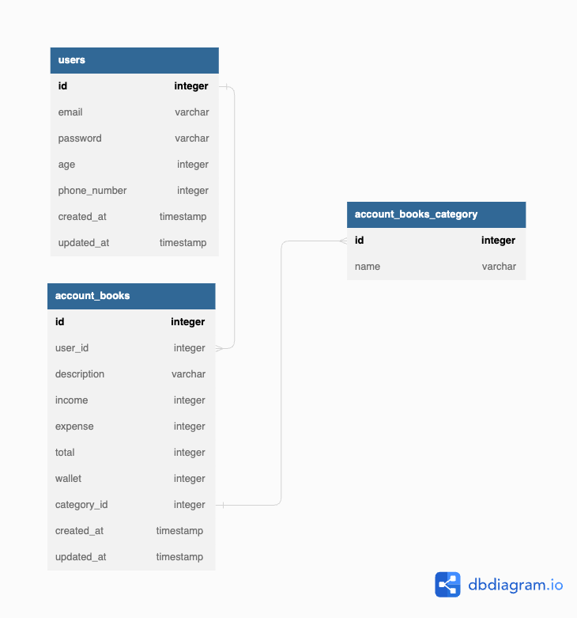

# Payhere

## 목차

---

- [기능구현](#기능구현)
- [API](#api)
- [작업 내용](#작업-내용)
  - [로그인 \& 회원가입 기능](#로그인--회원가입-기능)
  - [서버 배포](#서버-배포)
  - [구현 못한 내용](#구현-못한-내용)
- [Blocker](#blocker)
- [ERD](#erd)

## 기능구현

---

- [x] 로그인 기능
- [x] 회원가입 기능
- [x] AWS EC2 배포

## API

---

- 회원가입

```sh
POST http://hanjaelee.com/users/signup

  body : {
  "email": "jayhanjaelee@gmail.com",
  "password": "1234"
  }
```

- 로그인

```sh
GET http://hanjaelee.com/users/signin

  body : {
  "email": "jayhanjaelee@gmail.com",
  "password": "1234"
  }
```

## 작업 내용

---

### 로그인 & 회원가입 기능

---

다음은 작업한 내용에 대한 설명입니다.

클라이언트의 email, password 를 request body 로 입력 받아서
로그인, 회원가입 기능 구현하였습니다.

model에는 유저의 나이, 핸드폰번호등 기타 정보를 넣어놓긴 하였는데 개발시 편의상 email 과 password 만 입력 받아서 기능 구현이 되도록 하였습니다.
실제 production 이 배포될 때엔 필요한 유저 정보 모두 입력받아 구현이 되어야 하겠습니다.
능
로그인시에는 클라이언트로부터 전달받은 이메일과 비밀번호에 대해 비밀번호가 DB에 있는 암호화되어있는 비밀번호와 비교하여 일치한다면 JWT 토큰을 응답으로 주도록 구현하였습니다.

JWT 토큰은 public claim 의 exp 속성값에 대하여 만료 기한을 UTC 기준 현재 시간보다 하루이후에 만료되도록 설정하였습니다.

보안을 강화하기 위해 만료시간을 줄이고 refresh token을 추가로 발급하는 로직을 구현했으면 더 좋았을 것 같습니다.

또한 로그아웃 기능구현을 위해 token에 대한 정보를 DB에 저장을 해야되는건지 의문을 가졌습니다.

이 의문을 가지게 된 이유는 기존에 token정보는 클라이언트가 가지고 있고 로그아웃시 브라우저상에 Local Storage같은 브라우저 저장소에서 토큰에 대한 정보를 지워주는 식으로 구현하면 될 것 이라고 생각꼈기 때문입니다.

따라서 과제에서는 API 서버 요구사항으로 로그아웃에 대한 언급이 있어서 고민을 하게 되었고 DB에 JWT 토큰을 저장한다면 JWT의 이점이 사라지는게 아닌가 생각이들었고 JWT로 로그아웃을 하는 로직에 대해 추가로 학습이 필요하겠다고 느꼈습니다.

회원가입시에 bcrypt 이용하여 유저 비밀번호 암호화 해서 mysql에 저장 하도록 구현이 되어있습니다.

### 서버 배포

---

Amazon EC2에 Ubuntu로 서버를 배포하였습니다.
mysql 5.7 버전과 django API 서버를 각각 Docker container로 구성하여 배포하였고.
nginx로 EC2에 요청이 올때 django app 으로 proxy 하도록 구현하였고.
Route53 으로 도메인을 EC2 아이피에 대햐여 매핑하였습니다.

### 구현 못한 내용

---

다음은 과제 수행간에 구현하지 못한 API 서버에서 필요한 비즈니스 로직에 대한 제 생각을 남깁니다.

회원가입시에 유저 email 이 DB에 이미 저장되어있는지 확인하여 중복 이메일 회원가입 불가하도록 로직이 필요 할 것 같습니다.

또한 이메일과 비밀번호의 유효성 검사도 필요 할 것 같습니다.

추가로 핵심기능인 가계부에 대한 구현도 못한부분을 아쉽다고 느껴 추후 개인적으로 구현해봐야겠다는 생각입니다.

또한 AWS 에 배포한 django 서버에서 css 파일을 못 불러오는 문제가 있습니다. 아마 CORS 와 관련한 문제라고 생각하고 있습니다.

### Blocker

---

4월 2일 일요일에 평소 재시작을 하지않았던 맥북을 재시작을 하고나니 mysql이 접속이 안되는 문제가 생겼었습니다. 기존에 8.0 버전이 설치되어있었고 과제 수행간 5.7 버전을 추가로 설치하였는데 컴퓨터 재시작하면서 무언가 버전간 충돌이 있었던걸로 보입니다.

따라서 문제 해결을 위해 mysql 재설치, 설정파일 수정을 하는데 시간을 많이 할애해서 작업 수행하는데 어려움이 있었고 이 과정을 통해

언제 예기치 않은 문제가 생길지 모르니 항상 긴장을 늦추지 말아야 하겠다는 생각과 MySQL의 설정에 대한 이해가 많이 필요하겠다고 느꼈습니다.

---

### ERD



- user table

유저의 기본정보로 email, password, age, phon_number 가 필요하겠다고 생각하였습니다. phone_number 는 추후에 회원가입시 혹은 비밀번호 찾기시 문자인증 수단으로도 활용 될 수 있을 것 같습니다.

- account_books table (가계부)

유저의 대한 가계부이기때문에 users 와 account_books 의 관계를 1:n 으로 설정하였습니다. 유저 한명은 여러개의 가계부를 관리하는게 가능합니다.

description 필드는 가계부 작성시 메모를 저장하는 필드로 설정해두었습니다.
income, expense, total 은 각각 수입, 지출 합계를 나타내는 필드로 고려하였습니다.

wallet 은 현재 가계부를 작성하고있는 유저의 총액에 대한 필드로 설정하였습니다.

카테고리는 account_books_category 에서 참조하여 가져올수 있도록 외래키로 설정하였습니다.

- account_books_category

가계부 카테고리들을 저장하는 용도의 테이블 입니다.
가계부 지출이 어느 분류에 속하는지에 대한 카테고리가 들어 갈 수 있습니다
ex) 식비, 쇼핑, 생활용품 등
